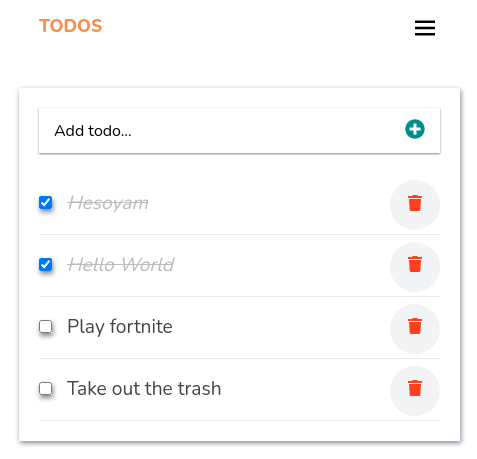

# Todo
Todo, is a single page web application (SPA) that lets you add tasks to the todo list, check tasks if you completed them and delete tasks too. Users also have the possibility of updating any task by double clicking on them. It's built using React.



## Technologies Used
* Languages (JSX, CSS)
* Library (React)
* Git
* Gitflow

## Live Demo
* [Live Demo](https://mcrvs-todo.herokuapp.com/todos)


## Software Requirements
* Node.JS
* npm
* Code Editor
* Git

## Installation
* Clone the repo using the command below

```
git clone git@github.com:charlesgobina/react-todo.git
```

* Navigate to the directory in which you cloned the project and use the command below

```
cd react-todo
```

* Install all project dependencies and packages using the command below

```
npm install
```

* Start the server to run the application locally using the command below

```
npm start
```

## Authors
Charles Gobina :student: 
* Github:https://github.com/charlesgobina 
* Twitter:https://twitter.com/i4mCloud
* LinkedIn:https://www.linkedin.com/in/charles-gobina-74a0ab193/

## Contributing :handshake:
Contributions, issues, and feature requests are welcome!
* Fork this repo using the command below

```
gh repo fork git@github.com:charlesgobina/react-todo.git
```
* Clone the forked repo using the command below

```
git clone git@github.com:charlesgobina/react-todo.git
```

* Navigate to the directory in which you cloned the project and use the command below

```
cd react-todo
```

* Switch to dev branch using the command below

```
git checkout dev
```

* Create a new feature branch using the command below

```
git checkout -b [name_of_feature_branch]
```

* Commit your changes using git commit as shown below

```
git commit -m ["entere a commit message"]
```

* Push your changes using

```
git push -u origin [name_of_feature_branch]
```
* Open pull request to the dev branch


## Show your support
Give a 	:star: if you like this project.

## Acknowledgments
* Hat tip to anyone whose code was used
* Inspiration
* etc

## License :memo:
This project is [MIT](https://github.com/microverseinc/readme-template/blob/master/MIT.md) licensed
